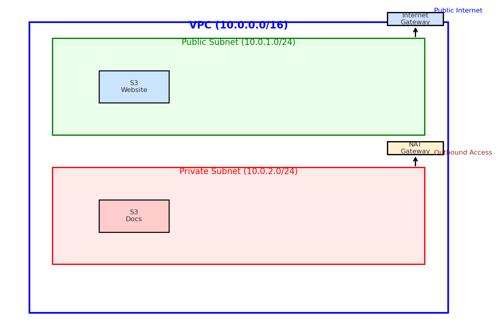

# **CloudLaunch Assignment**

## **Project Overview**
CloudLaunch is a lightweight cloud-based product deployed on AWS. It has two main components:
1. A **public static website** hosted on Amazon S3.  
2. A **private internal document storage system** using Amazon S3 with IAM-based access control.  

The project also demonstrates secure **VPC network design** and IAM best practices.

---
### Region Selection
Although the Africa (Cape Town) region (`af-south-1`) is geographically the closest to Nigeria, it was not enabled by default for my account. AWS requires an additional step to opt in to some regions like Cape Town.  
For this project, I used the default region provided at login (`us-east-1` – N. Virginia). This region is fully supported and ensured that all required services (S3, IAM, and VPC) were available without restrictions.

## **1. Static Website Hosting**
- **Service:** Amazon S3  
- **Purpose:** Host the company’s website.  
- **Configuration:**
  - Create an S3 bucket (e.g., `cloudlaunch-website`).  
  - Enable **static website hosting**.  
  - Upload HTML, CSS, and JS files.  
  - Apply a bucket policy allowing **public read-only access** to objects.  
  - Use **CloudFront** with SSL/TLS for HTTPS delivery.  

**Example Bucket Policy (Read-Only Public Access):**
```json
{
  "Version": "2012-10-17",
  "Statement": [
    {
      "Sid": "PublicReadGetObject",
      "Effect": "Allow",
      "Principal": "*",
      "Action": "s3:GetObject",
      "Resource": "arn:aws:s3:::cloudlaunch-website/*"
    }
  ]
}
```

---

## **2. Internal Private Document Storage**
- **Service:** Amazon S3  
- **Purpose:** Secure storage for private company documents.  
- **Configuration:**
  - Create another S3 bucket (e.g., `cloudlaunch-docs`).  
  - Block all public access.  
  - Grant access only to authorized IAM users/groups.  

**Example IAM Policy (Private Docs Access):**
```json
{
  "Version": "2012-10-17",
  "Statement": [
    {
      "Sid": "AllowDocsAccess",
      "Effect": "Allow",
      "Action": [
        "s3:ListBucket",
        "s3:GetObject",
        "s3:PutObject"
      ],
      "Resource": [
        "arn:aws:s3:::cloudlaunch-docs",
        "arn:aws:s3:::cloudlaunch-docs/*"
      ]
    }
  ]
}
```

---

## **3. VPC Network Layout**
A **custom VPC** is designed to separate public-facing resources from private internal resources.

### **VPC Configuration**
- **VPC CIDR Block:** `10.0.0.0/16`  
- **Subnets:**
  - Public Subnet → for resources needing internet access (e.g., bastion host).  
  - Private Subnet → for backend services or instances.  
- **Internet Gateway (IGW):** Provides internet access to the public subnet.  
- **NAT Gateway:** Allows instances in the private subnet to access the internet securely.  
- **Route Tables:**  
  - Public route table → routes `0.0.0.0/0` to IGW.  
  - Private route table → routes `0.0.0.0/0` to NAT gateway.  

---

## **4. Security Considerations**
- **IAM Best Practices:**
  - Enforce least privilege.  
  - Do not use root account.  
  - Use IAM roles for access.  

- **S3 Buckets:**
  - Website bucket → public read-only for objects.  
  - Docs bucket → strictly private, IAM-only access.  

- **Networking:**
  - Only public subnet resources exposed to the internet.  
  - Private subnet protected, with outbound access via NAT gateway.  

---

## **5. Architecture Diagram**
Below is the architecture diagram for CloudLaunch:  



---

## **6. Steps to Deploy**
1. Create two S3 buckets: `cloudlaunch-website` and `cloudlaunch-docs`.  
2. Upload website files to `cloudlaunch-website`.  
3. Enable static website hosting.  
4. Apply public read-only bucket policy to website bucket.  
5. Block public access on `cloudlaunch-docs`.  
6. Create IAM policy for document access and attach to users/groups.  
7. Create a custom VPC with public and private subnets, IGW, NAT gateway, and route tables.  
8. Test access:
   - Public website accessible via browser.  
   - Private docs only accessible to IAM-authenticated users.  
