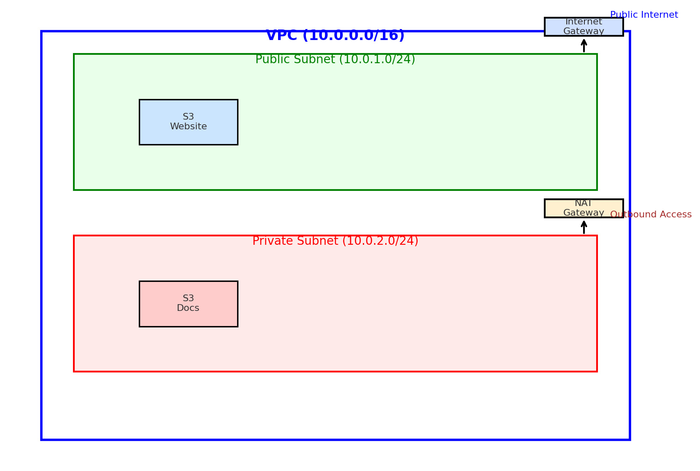

# 🌩️ CloudLaunch Project

## 📌 Overview
**CloudLaunch** is a lightweight AWS-based project that demonstrates:  
- Hosting a **static website** securely on **Amazon S3**.  
- Managing **internal private documents** with S3 + IAM access controls.  
- Designing a **VPC network** with public and private subnets, Internet Gateway, and NAT Gateway.  

This project highlights **AWS fundamentals**: S3, IAM, and VPC.

---

## 🚀 Features
- **Static Website Hosting**  
  - Public bucket with read-only access.  
  - Delivered via CloudFront (HTTPS enabled).  

- **Private Document Storage**  
  - Secure S3 bucket with IAM-only access.  
  - Enforces least privilege principle.  

- **VPC Network Design**  
  - Custom VPC (`10.0.0.0/16`).  
  - Public and private subnets.  
  - Internet Gateway + NAT Gateway.  
  - Separate route tables for public/private traffic.  

---

## 🛠️ Architecture Diagram


---

## 📂 Repository Structure
```
CloudLaunch_Assignment/
│── CloudLaunch.md               # Detailed assignment write-up
│── cloudlaunch-architecture.png # Architecture diagram
│── README.md                    # Repo overview
```

---

## 🔑 Security Best Practices
- **IAM**: No root account, enforce least privilege, use IAM roles/policies.  
- **S3**:  
  - Website bucket → public read-only access for objects.  
  - Docs bucket → strictly private, IAM-authenticated only.  
- **Networking**: Public subnet for internet-facing resources, private subnet protected behind NAT Gateway.  

---

## 📜 Deployment Steps (Summary)
1. Create two S3 buckets: `cloudlaunch-website` (public) and `cloudlaunch-docs` (private).  
2. Configure static website hosting on `cloudlaunch-website`.  
3. Apply public read-only bucket policy to the website bucket.  
4. Block all public access on `cloudlaunch-docs`.  
5. Create and attach IAM policy for private document access.  
6. Create custom VPC with subnets, IGW, NAT Gateway, and route tables.  
7. Verify:
   - Website is accessible via browser.  
   - Docs bucket only accessible to authorized IAM users.  
